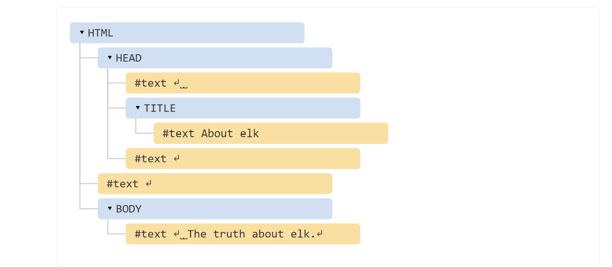
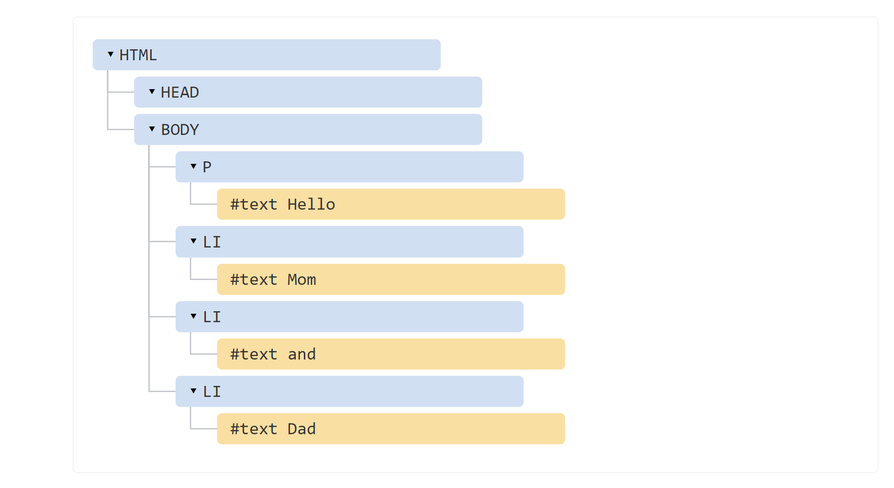
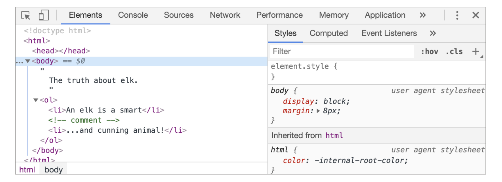
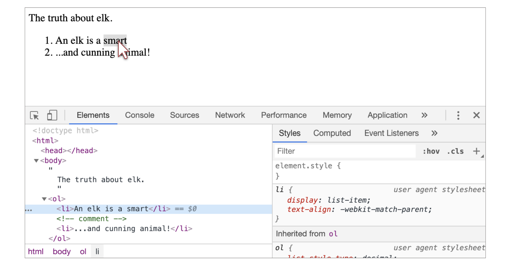

# DOM 树

HTML 文档的主干是标签(tag)。

根据文档对象模型(DOM),每个 HTML 标签都是一个对象。嵌套的标签是闭合标签的"子标签(children)"。标签内的文本也是一个对象。

所有这些对象都可以通过 JavaScript 来访问，我们可以使用它们来修改页面。

例如，`document.body`是表示`<body>`标签的对象。

运行这段代码会使`<body>`保持 3 秒红色状态:

```js
document.body.style.background = "red"; //将背景设置为红色

setTimeout(() => (document.body.style.background = ""), 3000); //恢复回去
```

在这，我们使用了`style.background`来修改`document.body`的背景颜色，但是还有很多其它的属性，
例如:

- `innerHTML`--节点的 HTML 内容。
- `offsetWidth`--节点宽度(以像素度量)
- .....等等

很快，我们将学习更多操作 DOM 的方法，但首先我们需要了解 DOM 的结构。

## DOM 的例子

让我们从下面这个简单的文档(document)开始:

```
    <!DOCTYPE HTML>
    <html>
    <head>
    <title>About elk</title>
    </head>
    <body>
        The truth about elk.
    </body>
    </html>
```

DOM 将 HTML 表示为标签的树形结构。它看起来如下所示:


在上面的图片中，你可以点击元素(element)节点，它们的子节点会打开/折叠。

每个树的节点都是一个对象。

标签被称为**元素节点**(或者仅仅是元素)，并形成了树状结构:`<html>`在根节点，`<head>`和`<body>`是其子项，等。

元素内的文本形成**文本节点**，被标记为`#text`。一个文本节点只包含一个字符串。它没有子项，并且总是树的叶子。

例如，`<title>`标签里面有文本`"About elk"`。

请注意文本节点中的特殊字符:

- 换行符:`↵`(在 JavaScript 中为`\n`)
- 空格:`␣`

空格和换行符都是完全有效的字符，就像字母和数字。它们形成文本系节点并成为 DOM 的一部分。所以，例如，在上面的示例中，`<head>`标签中的`<title>`标签前面只包含了一些空格，并且该文本变成了一个`#text`节点(它只包含一个换行符和一些空格)。

只有两个顶级排除项:

1. 由于历史原因，`<head>`之前的空格和换行符均被忽略。
2. 如果我们在`</body>`之后放置一些东西，那么它会被自动移动到`body`内，并处于`body`中的最下方，因为 HTML 规范要求所有内容必须位于`<body>`内。所以`</body>`之后不能有空格。

在其他情况下，一切都很简单--如果文档中有空格(就像任何字符一样)，那么它们将成为 DOM 中的文本节点，而如果我们删除它们，则不会有任何空格。

这是没有空格的文本节点:

```
    <!DOCTYPE HTML>
    <html><head><title>About elk</title></head><body>The truth elk.</body></html>
```


> **字符串开头/结尾处的空格，以及只有空格的文本节点，通常会被工具隐藏**
> 与 DOM 一起使用的浏览器工具(即将介绍)，通常不会在文本的开始/结尾显示空格，并且在标签之间也不会显示空文本节点(换行符)。
>
> 开发者工具通过这种方式节省屏幕空间。
>
> 在本教程中，如果这些空格和空文本节点无关紧要时，我们在后面出现的关于 DOM 的示意图中会忽略它们。这样的空格通常不会影响文档的显示方式。

## 自动修正

如果浏览器遇到格式不正确的 HTML，它会在形成 DOM 时自动更正它。

例如，顶级标签总是`<html>`，即使它不存在于文档中--它也会出现在 DOM 中，因为浏览器会创建它。对于`<body>`也是一样。

例如，如果一个 HTML 文件只有一个单词"Hello",浏览器则会把它包装到`<html>`和`<body>`中，并且会添加到所需的`<head>`，DOM 将会变成下面这样:


在生成 DOM 时，浏览器会自动处理文档中的错误，关闭标签等。

一个没有关闭标签的文档:

```
    <p>Hello
    <li>Mom
    <li>and
    <li>Dad
```

....将成为一个正常的 DOM，因为浏览器在读取标签时会填补缺失的部分:


> **表格永远有`<tbody>`**
> 表格是一个有趣的"特殊的例子"。按照 DOM 规范，它们必须有`<tbody>`标签，但 HTML 文本可能会忽略它。然后浏览器在创建 DOM 时，自动地创建了
> `<tbody>`
>
> 对于 HTML:
>
> ```
>  <table id="table"><tr><td>1</td></tr></table>
> ```
>
> DOM 结构会变成:
> 
> 看到了吗？`<tbody>`出现了。我们应该记住这一点，以免再使用表格时，对这种情况感到惊讶。

## 其他节点类型

除了元素文本节点外，还有一些其他的节点类型。

例如，注释:

```
    <!DOCTYPE HTML>
    <html>
    <body>
    THe truth about elk.
    <ol>
    <li>An elk is a smart</li>
    <!-- comment -->
    <li>...and cunning animal!</li>
    </ol>
    </body>
    </html>
```


在这里我们可以看到一个新的树节点类型--**comment 节点**，被标记为`#comment`，它在两个文本节点之间。

我们可能会想--为什么要将注释添加到 DOM 中？它不会对视觉展现产生影响吗？但是有一条规则--如果一些内容存在于 HTML 中，那么它也必须在 DOM 树中。

**HTML 中的所有内容，甚至注释，都会成为 DOM 地一部分。**

甚至 HTML 开头的`<!DOCTYPE...>`指令也是一个 DOM 节点。它在 DOM 树中位于`<html>`之前。很少有人知道这一点。我们不会触及那个节点，我们甚至不会在图表中绘制它，但它确实就在那里。

表示整个文档的`document`对象，在形式上也是一个 DOM 节点。

一共有[12 种节点类型](https://dom.spec.whatwg.org/#node)。实际上，我们通常用到的是其中的 4 种:

1. `document`--DOM 的"入口点"。
2. 元素节点--HTML 标签，树构建块。
3. 文本节点--包含文本。
4. 注释--有时我们可以将一些信息放入其中，它不会显示，但 JS 可以从 DOM 中读取它。

## 自己看看

要在实际中查看 DOM 结构，请尝试[Live DOM Viewer](http://software.hixie.ch/utilities/js/live-dom-viewer/)。只需输入文档，它将立即显示为 DOM。

探索 DOM 的另一种方式是使用浏览器开发工具。实际上，这就是我们在开发中所使用的。

你可以打开这个网页[elk.html](https://zh.javascript.info/article/dom-nodes/elks.html)，然后打开浏览器开发者工具，并切换到元素(Elements)选项卡。

它看起来像这样:


你可以看到 DOM，点击元素，查看它们的细节等。

请注意，开发者工具中的 DOM 结构是经过简化的。文本节点仅以文本形式显示。并且根本没有"空白"(只有空格)的文本节点。这其实挺好，因为大多数情况下，我们只关心元素节点。

点击左上角的"箭头"按钮可以让我们使用鼠标(或者其他指针设备)从网页中选择一个节点并"检查(inspect)"它(在元素选项卡中滚动到该节点)。当我们有一个巨大的 HTML 页面(和相应的巨大 DOM)，并希望查看其中的一个特定元素的位置时，这很有用。

另一种方法是在网页上右键单击，然后在上下文菜单中选择"检查(Inspect)"。


在工具的右侧部分有以下子选项卡:

- **Style**--我们可以看到按规则应用于当前元素的 css 规则，包括内建规则(灰色)。几乎所有内容都可以就地编辑，包括下面的方框的 dimension/margin/padding。
- **Computed**--按属性查看应用于元素的 CSS:对于每个属性，我们都可以看到赋予它的规则(包括 CSS 继承等)。
- **Event Listeners**--查看附加到 DOM 元素的事件侦听器
- ....等。

学习它们的最佳方式就是多点一点看一看。大多数值都是可以就地编辑的。

## 与控制台交互

在我们处理 DOM 时，我们可能还希望对其应用 JavaScript。例如:获取一个节点并运行一些代码来修改它，以查看结果。以下是在元素(Element)选项卡和控制台(Console)之间切换的一些技巧。

首先:

- 在元素(Element)选项卡中选择第一个`<li>`
- 按下`Esc`--它将在元素(Elements)选项卡下方打开控制台(Console)。

现在最后选中的元素可以通过`$0`来进行操作，在之前的选择中则是`$1`。

我们可以对它们执行一些命令。例如,
`#0.style.background = 'red' `使选定的列表项(list item)变成红色，像这样:


这就是在控制台(Console)中获取元素(Elements)选项卡中的节点的方法。

还有一种方式。如果存在引用节点的变量，那么我们可以在控制台(Console)中使用命令`inspect(node)`，来在元素(Elements)选项卡中查看它。

或者我们可以直接在控制台(Console)中输出 DOM 节点，
并"就地"探索它，例如下面的`document.body`:


当然，这是出于调试目的。

浏览器开发者工具对于开发者有很大的帮助:我们可以探索 DOM，尝试一些东西，并找出问题所在。

## 总结

HTML/XML 文档在浏览器内均被表示为 DOM 树。

- 标签(tag)成为元素节点，并形成文档结构。
- 文本(text)成为文本节点。
- ....等，HTML 中的所有东西在 DOM 中都有它的位置，甚至对注释也是如此。

我们可以使用开发者工具来检查(inspect) DOM 并手动修改它。

在这里，我们介绍了基础知识，入门最常用和最重要的行为。在 https://developers.google.cn/web/tools/chrome-devtools 上有关于 Chrome 开发者工具的详细文档说明。

DOM 节点具有允许我们在它们之间移动，修改它们，在页面中移动等的属性和方法。
