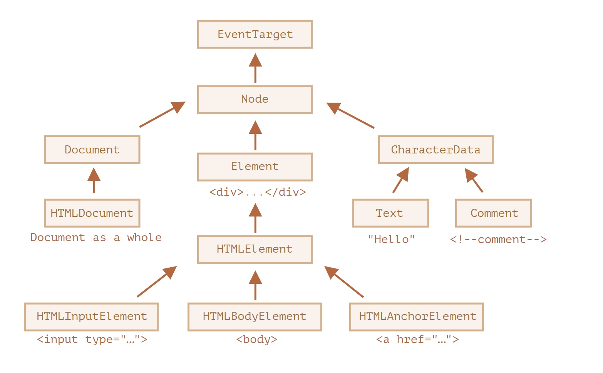

# 节点属性:type,tag 和 content

让我们深入了解以下 DOM 节点。

在本章中，我们将更深入了解它们是什么，并学习它们最常用的属性。

## DOM 节点类

不同的 DOM 节点可能有不同的属性。例如，标签`<a>`相对应的元素节点具有链接相关的(link-related)属性，标签`<input>`相对应的元素节点具有与输入相关的属性，等。文本节点与元素节点不同。但是所有这些标签对应的 DOM 节点之间也存在共有的属性和方法，因为所有类型的 DOM 节点都形成了一个单一层次的结构(single hierarchy)。

每个 DOM 节点都属于相应的内建类。

层次结构(hierarchy)的根节点是[EventTarget](https://dom.spec.whatwg.org/#eventtarget),[Node](https://dom.spec.whatwg.org/#interface-node)继承自它，其他 DOM 节点继承自 Node。

下图做了进一步说明:



类如下所示:

- [EventTarget](https://dom.spec.whatwg.org/#eventtarget)是一切的根"抽象(abstract)"类。

  该类的对象从未被创建。它作为一个基础，以便让所有 DOM 节点都支持所谓的"事件(event)"，我们会在之后学习它。

- [Node](http://dom.spec.whatwg.org/#interface-node)--也是一个"抽象"类，充当 DOM 节点的基础。

  它提供了树的核心功能:`parentNode`,`nextSibling`,`childNodes`等(它们都是 getter)。`Node`类的对象从未被创建。但是还有一些继承自它的其他类(因此继承了`Node`的功能)。

- [Document](https://dom.spec.whatwg.org/#interface-document)由于历史原因通常被`HTMLDocument`继承(尽管最新的规范没有规定)--是一个整个的文档。

  全局变量`document`就是属于这个类。它作为 DOM 的入口。

- [CharacterData](https://dom.spec.whatwg.org/#interface-characterdata)--一个"抽象类"，被下述类继承:

  - [Text](https://dom.spec.whatwg.org/#interface-text)--对应与元素内部文本的类，例如`<p>Hello</p>`中的`Hello`。
  - [Comment](https://dom.spec.whatwg.org/#interface-comment)--注释类。它们不会被展示出来，但每个注释都会成为 DOM 中的一员。

- [Element](http://dom.spec.whatwg.org/#interface-element)--是 DOM 元素的基础类。

  它提供了元素级导航(navigation),如`nextElementSibling`,`children`,以及搜索方法，如`getElementsByTagName`和`querySelector`。

  浏览器不仅支持 HTML，还支持 XML 和 SVG。因此，`Element`类充当的是更具体的类的基础:
  `SVGElement`,`XMLElement`(我们在这里不需要它)和`HTMLElement`。

- 最后，[HTMLElement](https://html.spec.whatwg.org/multipage/dom.html#htmlelement)--是所有 HTML 元素的基础类。我们大部分时候都会用到它。

  它会被更具体的 HTML 元素继承:

  - [HTMLInputElement](https://html.spec.whatwg.org/multipage/forms.html#htmlinputelement)--`<input>`元素的类
  - [HTMLBodyElement](https://html.spec.whatwg.org/multipage/semantics.html#htmlbodyelement)--`<body>`元素的类，
  - [HTMLAnchorElement](https://html.spec.whatwg.org/multipage/semantics.html#htmlanchorelement)--`<a>`元素的类，
  - ....等。

还有很多其他标签具有自己的类，可能还具有特定的属性和方法，而一些元素，如`<span>`,`<section>`,`<article>`等，没有任何特定的属性，所以它们是`HTMLElement`类的实例。

因此，给定节点的全部属性和方法都是继承链的结果。

例如，我们考虑一下`<input>`元素的 DOM 对象。它属于[HTMLInputElement](https://html.spec.whatwg.org/multipage/forms.html#htmlinputelement)类。

它获取属性和方法，并将其作为下列类(按继承顺序列出)的叠加:

- `HTMLInputElement`--该类提供特定于输入的属性，
- `HTMLElement`--它提供了通用(common)的 HTML 元素方法(以及 getter 和 setter)。
- `Element`--提供通用(generic)元素方法，
- `Node`--提供通用 DOM 节点属性，
- `EventTarget`--为事件(包括事件本身)提供支持，
- ....最后，它继承自`Object`，因为像`hasOwnProperty`这样的"普通对象"方法也是可用的。

我们可以通过回调来查看 DOM 节点类名，因为对象通常都具有`constructor`属性。它引用类的 constructor，
`constructor.name`就是它的名称:

```js
alert(document.body.constructor.name); //HTMLBodyElement
```

....或者我们可以对其使用`toString`方法:

```js
alert(document.body); //[object HTMLBodyElement]
```

我们还可以使用`instanceof`来检查继承:

```js
alert(document.body instanceof HTMLBodyElement); //true
alert(document.body instanceof HTMLElement); // true
alert(document.body instanceof Element); // ture
alert(document.body instanceof Node); // true
alert(document.body instanceof EventTarget); // ture
```

正如我们所看到的，DOM 节点是常规的 JavaScript 对象。它们使用基于原型的类进行继承。

在浏览器中，使用`console.dir(elem)`输出元素来查看也是非常容易的。在控制台中，你可以看到`HTMLElement.prototype`和`Element.prototype`等。

> **`console.dir(elem)`与`console.log(elem)`**
> 大多数浏览器在其开发工具中都支持这两个命令:
> `console.log`和`console.dir`。它们将它们的参数输出到控制台中。对于 JavaScript 对象，这些命令通常做的是相同的事情。
>
> 但对于 DOM 元素，它们是不同的:
>
> - `console.log(elem)`显示元素的 DOM 树。
> - `console.dir(elem)`将元素显示为 DOM 对象，非常适合探索其属性。
>
> 可以在`document.body`上尝试一下。

> **规范中的 URL**
> 在规范中，DOM 类不是使用 JavaScript 来描述的，而是一种特殊的[接口描述语言(Interface description)](https://en.wikipedia.org/wiki/Interface_description_language)，简写为 IDL，它通常很容易理解。
>
> 在 IDL 中，所有属性以其类型开头。例如，`DOMString`和`boolean`等。
>
> 以下是摘录(except),并附有注释:
>
> ```js
> //定义 HTMLInputElement
> //冒号 ":" 表示 HTMLInputElement 继承自 HTMLELement
> interface HTMLInputElement:HTMLElement {
> // 接下来是<input /> 元素的属性和方法
> // "DOMString" 表示属性的值是字符串
> attribute DOMString accept;
> attribute DOMString alt;
> attribute DOMString autocomplete;
> attribute DOMString value;
> //布尔值属性 (true/false) attribute boolean
> autofocus;
> ...
> //现在方法: "void" 表示方法没有返回值
> void select();
> }
> ```

## "node Type"属性

`nodeType`属性提供了另一种"过时的"用来获取 DOM 节点类型的方法。

它有一个数值类型值(numeric value):

- 对于元素节点`elem.nodeType == 1`;
- 对于文本节点`elem.nodeType == 3`;
- 对于 document 对象`elem.nodeType == 9`,
- 在[规范](https://dom.spec.whatwg.org/#node)中还有一些其他值。

例如:

```html
<body>
  <script>
    let elem = document.body;

    //让我们检查以下:elem中的节点类型是什么？
    alert(elem.nodeType); // 1 => element

    //它的第一个子节点的类型是.....
    alert(elem.firstChild.nodeType); //3 => text

    //对于 document 对象，类型是 9
    alert(document.nodeType); // 9
  </script>
</body>
```

在现代脚本中，我们可以使用`instanceof`和其他基于类的检查方法来查看节点类型，但有时`nodyType`可能更简单。我们只能获取`nodeType`而不能修改它。

## 标签:nodeName 和 tagName

给定一个 DOM 节点，我们可以从`nodeName`或者`tagName`属性中读取它的标签名:

例如:

```js
alert(document.body.nodeName); //BODY
alert(document.body.tagName); //BODY
```

tagName 和 nodeName 之间有什么不同吗？

当然，差异就体现在它们的名字上，但确实有些微妙。

- `tagName`属性仅适用于`Element`节点。
- `nodeName`是为任意`Node`定义的:
  - 对于元素，它的意义与`tagName`相同。
  - 对于其他节点类型(text,comment 等)，它拥有一个对应节点类型的字符串。

换句话说，`tagName`仅受元素节点支持(因为它起源于`Element`类),而`nodeName`则可以说明其他节点类型。

例如，我们比较一下`document`的`tagName`和`nodeName`，以及一个注释节点:

```html
<body>
  <!-- comment -->

  <script>
    //for comment
    alert(document.body.firstChild.tagName); //undefined (不是一个元素)
    alert(document.body.firstChild.nodeName); // #comment

    // for document
    alert(document.tagName); // undefined
    alert(document.nodeName); // #comment
  </script>
</body>
```

如果我们只处理元素，那么`tagName`和`nodeName`这两种方法，我们都可以使用，没有区别。

> **标签名称始终是大写的，除非是在XML模式下**
> 浏览器有两种文档(document)的模式:HTML和XML。通常，HTML模式用于网页。只有在浏览器接收到带有`Content-Type:application/xml+xhtml`header的XML-document时，XML模式才会被启用。
> 
> 在HTML模式下，`tagName/nodeName`始终是大写的:它是``