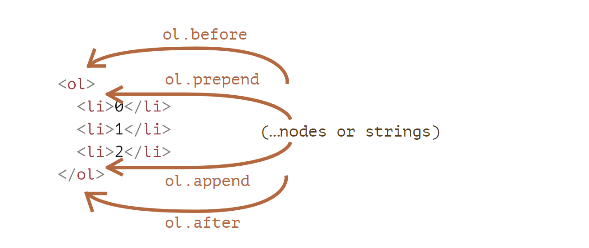
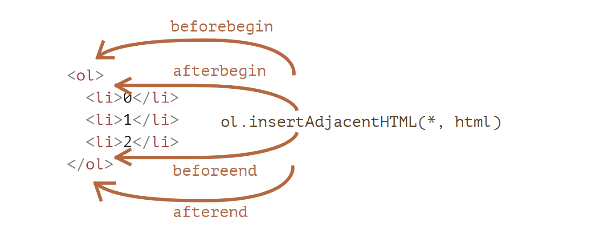

# 修改文档 (document)

DOM 修改是创建"实时"页面的关键。

在这里，我们将会看到如何"即时"创建新元素并修改现有页面内容。

## 例子:展示一条消息

让我们使用一个示例进行演示。我们将在页面上添加一条比`alert`更好看的消息。

它的外观如下:

```html
<style>
  .alert {
    padding: 15px;
    border: 1px solid #d6e9c6;
    border-radius: 4px;
    color: #3c763d;
    background-color: #dff0d8;
  }
</style>

<div class="alert">
  <strong>Hi there!</strong> You're read an important message.
</div>
```

这是一个 HTML 元素。现在，让我们使用 JavaScript 创建一个相同的`div`(假设样式已经在 HTML/CSS 文件中)。

## 创建一个元素

要创建 DOM 节点，这里有两种方法:

`document.createTextNode(text)`
用给定的文本创建一个**文本节点**:

```js
let textNode = document.createTextNode("Here I am ");
```

在大多数情况下，我们需要为此消息创建像`div`这样的元素节点。

### 创建一条消息

创建一个消息`div`分为 3 个步骤:

```js
//1.创建<div>元素
let div = document.createElement("div");

//2.将元素的类设置为 "alert"
div.className = "alert";

//3.填充消息内容
div.innerHTML = "<strong>Hi there!</strong> You're read an important message.";
```

我们已经创建了该元素。但到目前为止，它还只是一个名为`div`的变量中，尚未在页面中。所以我们无法在页面上看到它。

## 插入方法

为了让`div`显示出来，我们需要将其插入到`document`中的某处。例如，通过`document.body`将其插入到`<body>`元素里。

对此有一个特殊的方法`append`:
`document.body.append(div)`.

这是完整的代码:

```html
<style>
  .alert {
    padding: 15px;
    border: 1px solid #d6e9c6;
    border-radius: 4px;
    color: #3c763d;
    background-color: #dff0d8;
  }
</style>

<script>
  let div = document.createElement("div");
  div.className = "alert";
  div.innerHTML =
    "<strong>Hi there!</strong> You're read an important message.";

  document.body.append(div);
</script>
```

在这个例子中，我们对`document.body`调用了`append`方法。不过我们可以在其他任何元素上调用`append`方法，以将另一个元素放入到里面。例如，通过调用`div.append(anotherElement)`，我们便可以在`<div>`末尾添加一些内容。

这里是更多的元素插入方法，指明了不同的插入位置:

- `node.append(...nodes or strings)`--在`node`**末尾**插入节点或字符串，
- `node.prepend(...nodes or strings)`--在`node`**开头**插入节点或字符串，
- `node.before(...nodes or strings)`--在`node`**前面**插入节点或字符串，
- `node.after(...nodes or strings)`--在`node`**后面**插入节点或字符串，
- `node.replaceWith(...nodes or strings)`--将`node`替换为给定的节点或字符串。

这些方法的参数可以是一个要插入的任意的 DOM 节点列表，或者文本字符串(会被自动转换成文本节点)。

让我们在实际应用中看一看。

下面是使用这些方法将列表项添加到列表中，以及将文本添加到列表前面和后面的示例:

```html
<ol id="ol">
  <li>1</li>
  <li>2</li>
  <li>3</li>
</ol>

<script>
  ol.before("before"); //将字符串 "before" 插入到 <ol> 前面
  ol.after("after"); //将字符串 "after" 插入到 <ol> 前面

  let liFirst = document.createElement("li");
  liFirst.innerHTML = "prepend";
  ol.prepend(liFirst); //将 liFirst 插入到 <ol> 的最开始

  let liLast = document.createElement("li");
  liLast.innerHTML = "append";
  ol.append(liLast); //将 liLast 插入到 <ol> 的最末尾
</script>
```

这张图直观地显示了这些方法所做的工作:



因此，最终列表将为:

```html
before
<ol id="ol">
  <li>prepend</li>
  <li>0</li>
  <li>1</li>
  <li>2</li>
  <li>append</li>
</ol>
after
```

如上所述，这些方法可以在单个调用中插入多个节点列表和文本片段。

例如，在这里插入了一个字符串和一个元素:

```html
<div id="div"></div>
<script>
  div.before("<p>Hello</p>", document.createElement("hr"));
</script>
```

请注意:这里的文字都被"作为文本"插入，而不是"作为 HTML 代码"。因此像`<`,`>`这样的符号都会被转义处理来保证正确显示。

所以，最终的 HTML 为:

```html
&lt;p&gt;Hello&lt;/p&gt;
<hr />
<div id="div"></div>
```

换句话说，字符串被以一种安全的方式插入到页面中，就像
`elem.textContent`所做的一样。

所以，这些方法只能用来插入 DOM 节点或文本片段。

但如果我们想要将内容"作为 HTML 代码插入"，让内容中的所有标签和其他东西都像使用`elem.innerHTML`所表现的效果一样，那应该怎么办呢？

## insertAdicaentHTML/Text/Element

为此，我们可以使用另一个非常通用的方法:
`elem.insertAdjacentHTML(where,html)`。

该方法的第一个参数是代码字(code word)，指定相对于`elem`的插入位置。必须为一下之一:

- `"beforebegin`--将`html`插入到`elem`之前，
- `afterbegin`--将`html`插入到`elem`开头，
- `beforeend`--将`html`插入到`elem`末尾，
- `afterend`--将`html`插入到`elem`之后。

第二个参数是 HTML 字符串，该字符串会被"作为 HTML"插入。

例如:

```html
<div id="div"></div>
<script>
  div.insertAdjacentHTML("beforebegin", "<p>Hello</p>");
  div.insertAdiacentHTML("afterend", "<p>Bye</p>");
</script>
```

....将导致:

```html
<p>Hello</p>
<div id="div"></div>
<p>Bye</p>
```

这就是我们可以在页面上附加任意 HTML 的方式。

这是插入变体的示意图:



我们很容易就会注意到这张图和上一张图片的相似之处。插入点实际上是相同的，但此方法插入的是 HTML。

这个方法有两个兄弟:

- `elem.insertAdjacenText(where,text)`--语法一样，但是将`text`字符串"作为文本"插入而不是作为 HTML。
- `elem.insertAdjacentElement(wher,elem)`--语法一样，但是插入的是一个元素。

它们的存在主要是为了使语法"统一"。实际上，大多数时候只使用`insertAdjacentHTML`。因为对于元素和文本，我们有`append/prepend/before/after`方法--它们也可以用于插入节点/文本片段，但写起来更短。

所以，下面是显示一笑消息的另一种变体:

```html
<style>
  .alert {
    padding: 15px;
    border: 1px solid #d6e9c6;
    border-radius: 4px;
    color: #3c763d;
    background-color: #dff0d8;
  }
</style>

<script>
  document.body.insertAdjacentHTML("afterbegin",`<div class="alert">
  <strong>Hi there!</strong>You're read an important message.
  </div>');
</script>
```

## 节点移除

想要移除一个节点，可以使用`node.remove()`。

让我们的消息在一秒后消息:

```html
<style>
  .alert {
    padding: 15px;
    border: 1px solid #d6e9c6;
    border-radius: 4px;
    color: #3c763d;
    background-color: #dff0d8;
  }
</style>

<script>
  let div = document.createElement("div");
  div.className = "alert";
  div.innerHTML =
    "<strong>Hi there!</strong> You're read an important message.";

  document.body.append(div);
  setTimeout(() => div.remove(), 1000);
</script>
```

请注意:如果我们想要一个元素**移动**到另一个地方，则无需将其从原来的位置中删除。

**所有插入方法都会自动从旧位置删除该节点。**

例如，让我们进行元素交换:

```html
<div id="first">First</div>
<div id="second">Second</div>
<script>
  //无需调用 remove
  second.after(first); //获取 #second,并在其后面插入 #first
</script>
```

## 克隆节点:cloneNode

如何再插入一条类似的消息?

我们可以创建一个函数，并将代码放在其中。但是另一种方法是**克隆**现有的`div`，并修改其中的文本(如果需要)。

当我们有一个很大的元素时，克隆的方式可能更快更简单。

调用`elem.cloneNode(true)`来创建元素的一个"深"克隆--具有所有特性(attribute)和子元素。如果我们调用
`elem.cloneNode(false)`，那克隆就不包括子元素。

一个拷贝消息的示例:

```html
<style>
  .alert {
    padding: 15px;
    border: 1px solid #d6e9c6;
    border-radius: 4px;
    color: #3c763d;
    background-color: #dff0d8;
  }
</style>

<div class="alert" id="div">
  <strong>Hi there!</strong> You're read an important message.
</div>

<script>
  let div2 = div.cloneNode(true); //克隆消息
  div2.querySelector("strong").innerHTML = "Bye there!"; //修改克隆

  div.after(div2); //在已有的 div 后显示克隆
</script>
```

## DocumentFragment

`DocumentFragment`是一个特殊的 DOM 节点，用来传递节点列表的包装器(wrapper)。

我们可以向其附加其他节点，但是当我们将其插入某个位置时，则会插入其内容。

例如，下面这段代码中的`getListContent`会生成带有
`<li>`列表项的片段，然后将其插入到`<ul>`中:

```html
<ul id="ul"></ul>

<script>
  function getListContent() {
    let fragment = new DocumentFragment();

    for (let i = 1; i <= 3; i++) {
      let li = document.createElement("li");
      li.append(i);
      fragment.append(li);
    }

    return fragment;
  }

  ul.append(getListContent()); // (*)
</script>
```

请注意，在最后一行`(*)`我们附加了
`DocumentFragment`，但是它和`ul`"融为一体(blends in)"了，所以最终的文档结构应该是:

```html
<ul>
  <li>1</li>
  <li>2</li>
  <li>3</li>
  <li>4</li>
</ul>
```

`DomcumentFragment`很少被显示使用。如果可以改为返回一个节点数组，那为什么还要附加到特殊类型的节点上呢？重写示例:

```html
<ul id="ul"></ul>

<script>
  function getListContent() {
    let result = [];

    for (let i = 1; i <= 3; i++) {
      let li = document.createElement("li");
      li.append(i);
      result.push(li);
    }

    return result;
  }

  ul.append(...getListContent()); // append + "..." operator = friends!
</script>
```

我们之所以提到`DocumentFragment`，主要是因为它上面有一些概念，例如[template](https://zh.javascript.info/template-element)元素
