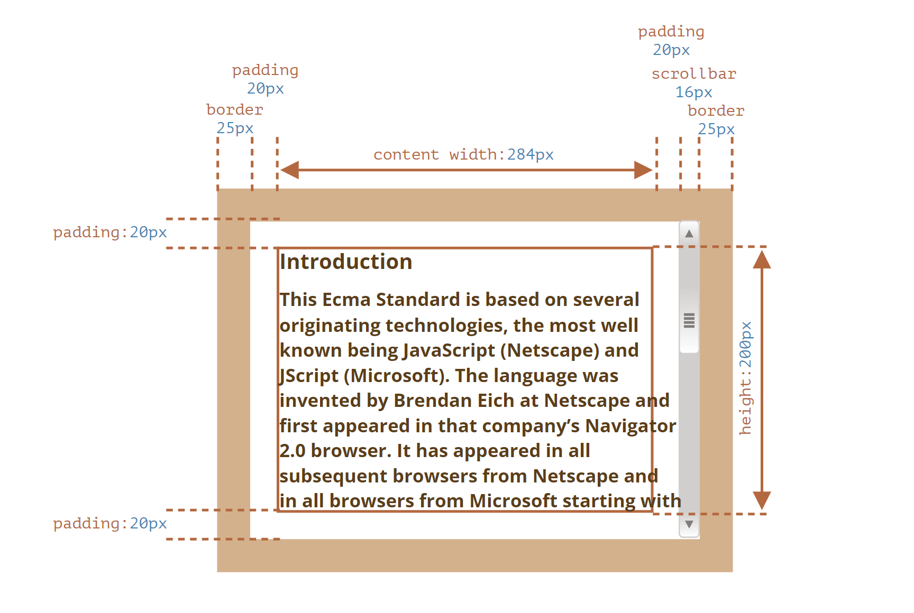
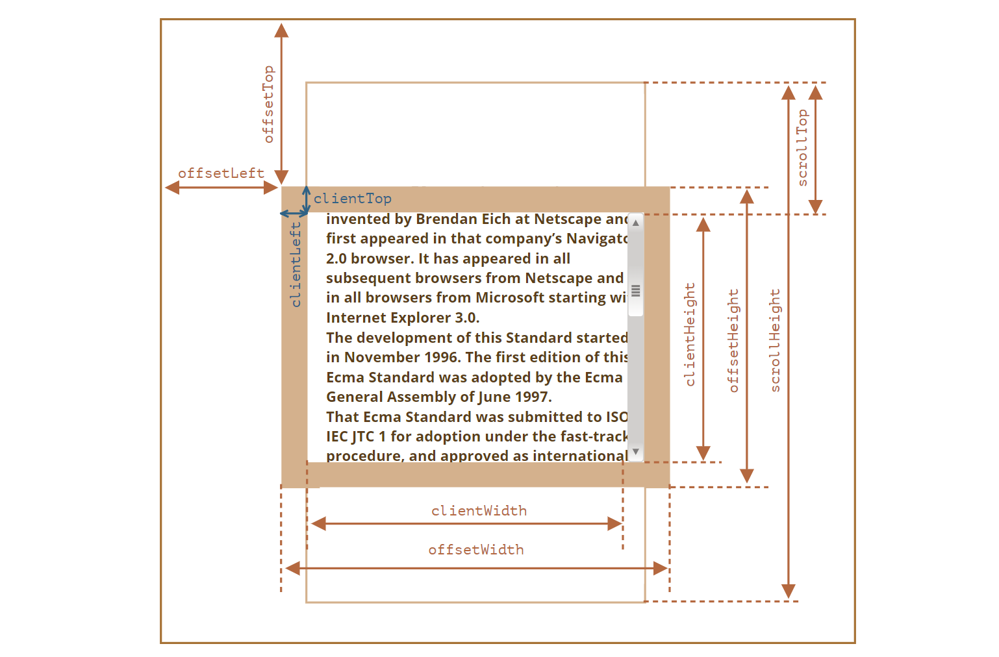
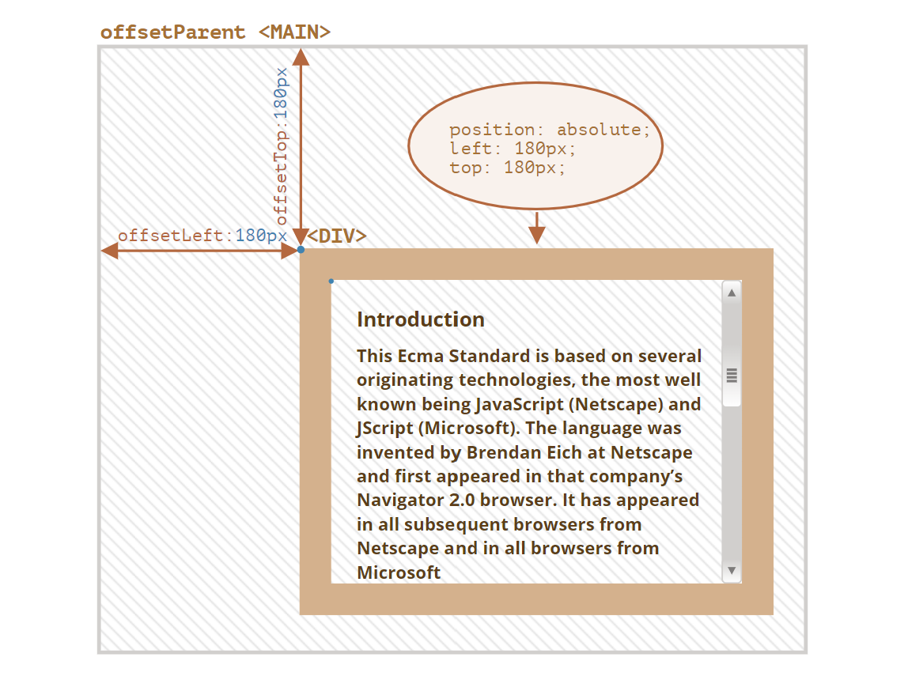
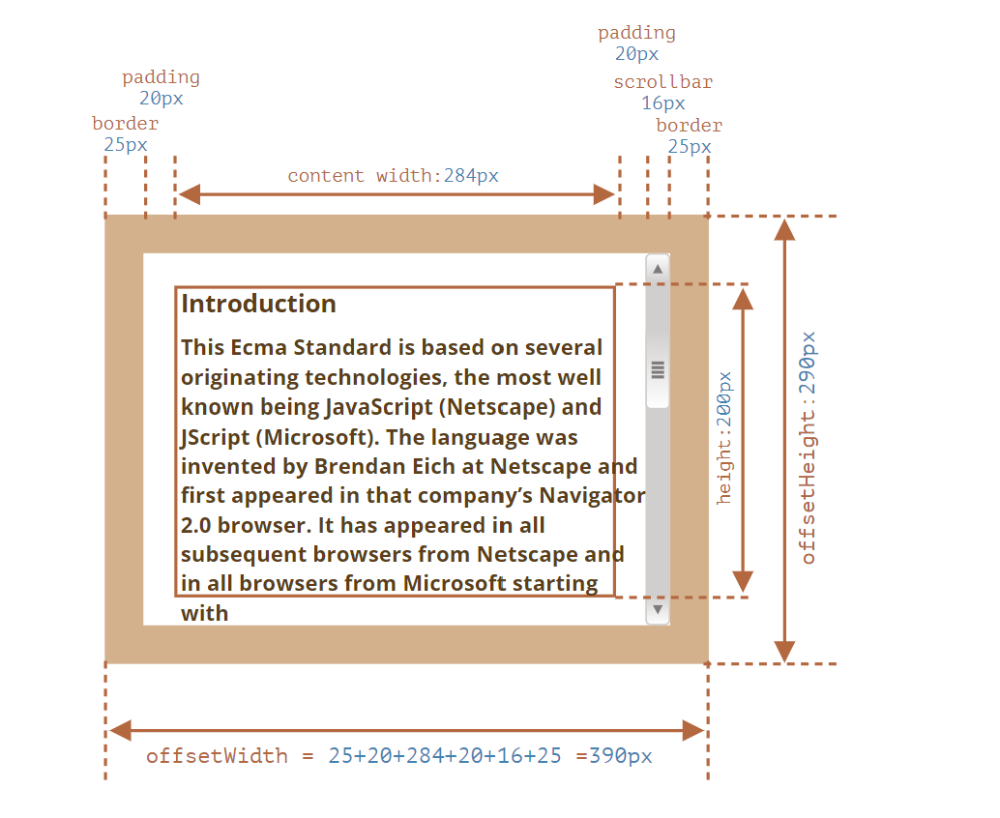

# 元素大小和滚动

JavaScript 中有许多属性可让我们读取有关元素宽度、高度和其他特征的信息。

我们在 JavaScript 中移动或定位元素时，我们会经常需要它们。

## 示例元素

作为演示属性的示例元素，我们将使用下面给出的元素:

```html
<div id="example">...Text...</div>

<style>
  #example {
    width: 300px;
    height: 200px;
    border: 25px solid #E8C8F;
    padding: 20px;
    overflow: auto;
  }
</style>
```

它有边框(border),内边距(padding)和滚动(scrolling)等全套功能。但没有外边距(margin)，因为它不是元素本身的一部分，并且它们没什么特殊的属性。

这个元素看起来就像这样:



> **注意滚动条**
> 上图演示了元素具有滚动条这种最复杂的情况。一些浏览器(并非全部)通过内容(上面标记为"content width")中获取空间来为滚动条保留空间。
>
> 因此，如果没有滚动条，内容宽度将是`300px`，但是如果滚动条宽度是`16px`(不同的设备和浏览器，滚动条的宽度可能有所不同)，那么还剩下`300 - 16 = 284px`，我们应该考虑到这一点。这就是为什么本章的例子总是假设有滚动条。如果没有滚动条，一些计算会更简单。

> **文本可能会溢出到`padding-bottom`中**
> 在我们的插图中的 padding 中通常显示为空，但是如果元素中有很多文本，并且溢出了，那么浏览器会在`padding-bottom`处显示"溢出"文本，这是正常现象。

## 几何

这是带有几何属性的整体图片:



这些属性的值在技术上讲是数字，但这些数字其实是"像素(pixel)"，因此它们是像素测量值。

让我们从元素外部开始探索属性。

## offsetParent,offsetLeft/Top

这些属性很少使用，但它们仍然是"最外面"的几何属性，所以我们将从它们开始。

`offsetParent`是最接近的祖先(ancestor)，在浏览器渲染期间，它被用于计算坐标。

最近的祖先为下列之一:

1. CSS 定位的(`position`为`absolute`、`relative`、`fixed`或`sticky`),
2. 或`<td>`、`<th>`、`<table>`，
3. 或`<body>`

属性`offsetLeft/offsetTop`提供相对于`offsetParent`左上角的 x/y 坐标。

在下面这个例子中，内部的`<div>`有`<main>`作为
`offsetParent`，并且`offsetLeft/offsetTop`让它从左上角位移(`180`):

```html
<main style="position:relative" id="main">
  <article>
    <div id="example" style="position:absolute;left:180px;top:180px">...</div>
  </article>
</main>

<script>
  alert(example.offsetParent.id); //main
  alert(example.offsetLeft); //180(注意:这是一个数字，不是一个字符串 "180px")
  alert(example.offsetTop); // 180
</script>
```



有以下几种情况下，`offsetParent`的值为`null`:

1. 对于未显示的元素(`display:none`或者不在文档中)
2. 对于`<body>`与`<html>`
3. 对于带有`position:fixed`的元素。

## offsetWidth/Height

现在，让我们继续关注元素本身。

这两个属性是最简单的。它们提供了元素的"外部"width/height。或者，换句话说，它的完整大小(包括边框)。



对于我们的示例元素:

- `offsetWidth = 30`--外部宽度(width)，可以计算为内部 CSS-width(`300px`)加上 padding(`2 * 20px`)和 border(`2 * 25px`)。
- `offsetHeight = 290`--外部高度(height)。

> **对于未显示的元素，几何属性为 0/null**
> 仅针对显示的元素计算几何属性。
>
> 如果一个元素(或其他任何祖先)具有`display:none`或不在文档中，则所有几何属性均为零(或`offsetParent`为`null`)。
>
> 例如，当我们创建了一个元素，但尚未将其插入文档中，或者它(或它的祖先)具有`display:none`时，
> `offsetParent`为`null`,并且`offsetWidth`和`offsetHeight`为`0`。
>
> 我们可以用它来检查一个元素是否被隐藏，像这样:
>
> ```js
> function isHidden(elem) {
>   return !elem.offsetWidth && !elem.offsetHeight;
> }
> ```
>
> 请注意，对于会展示屏幕上，但大小为零的元素，它们的`isHidden`返回`true`。
