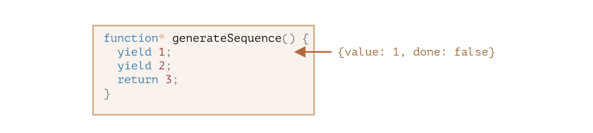
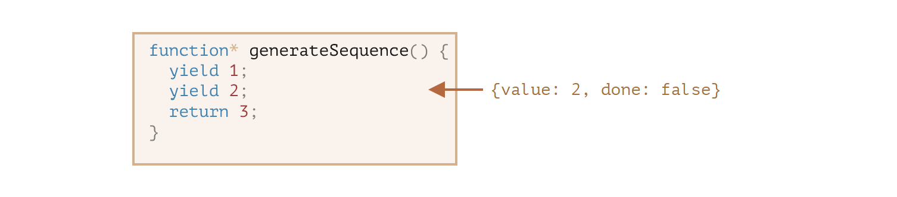

# generator

常规函数只会返回一个单一值(或者不返回任何值)。

而 generator 可以按需一个接一个地返回("yield")多个值。
它们可与[iterable](https://zh.javascript.info/iterable)完美配合使用，从而可以轻松地创建数据流。

## generator 函数

要创建一个 generator，我们需要一个特殊的语法结构:
`function*`,即所谓的"generator function"。

它看起来像这样:

```js
function* generateSequence() {
  yield 1;
  yield 2;
  return 3;
}
```

generator 函数与常规函数的行为不同。在此类函数被调用时，它不会运行其代码。而是返回一个被称为"generator object"的特殊对象，来管理执行流程。

我们来看一个例子:

```js
function* generateSequence() {
  yield 1;
  yield 2;
  return 3;
}

//"generator function" 创建了一个"generator object"
let generator = generateSequence();
alert(generator); //[object Generator]
```

到目前为止，上面这段代码中的**函数体**代码还没有开始执行:


一个 generator 的主要方法就是`next()`。当被调用时(译注：指`next()`方法)，它会恢复上图所示的运行，执行直到最近的`yield<value>`语句(`value`可以被省略，默认为`undefined`)。然后函数执行暂停，并将产出的(yielded)值返回到外部代码。

`next()`的结果始终是一个具有两个属性的对象:

- `value`：产出的(yield)的值。
- `done`:如果 generator 函数已执行则为`true`，否则为`false`。

例如，我们可以创建一个 generator 并获取其第一个产出的(yeild)值:

```js
function* generateSequence() {
  yield 1;
  yield 2;
  return 3;
}

let generator = generateSequence();

let one = generator.next();

alert(JSON.stringify(one)); //{value:1,done:false}
```

截至目前，我们只获得了第一个值，现在函数执行处在第二行:



让我们再次调用`generator.next()`。代码恢复执行并返回下一个`yield`的值:

```js
let two = generator.next();

alert(JSON.stringify(two)); //{value:2,done:false}
```



如果我们第三次调用`generator.next()`，代码将会执行到`return`语句，此时就完成这个函数的执行:

```js
let three = generaotr.next();

alert(JSON.stringify(three)); //{value:3,done:true}
```


现在 generator 执行完成。我们通过`done:true`可以看出来这一点，并且将`value:3`处理为最终结果。

再对`generator.next()`进行新的调用不再有任何意义。
如果我们这样做，它将返回相同的对象:`{done:true}`。

> `function* f(...)`或`function *f(...)`?
> 这两种语法都是对的。
>
> 但是通常更倾向于第一种语法，因为星号`*`表示它是一个 generator 函数，它描述的是函数种类而不是名称，因此`*`应该和`function`关键字紧贴一起。

## generator 是可迭代的

当你看到`next()`方法，或许你已经猜到了 generator 是[可迭代的(iterable)](https://zh.javascript.info/iterable)的。

我们可以使用`for..of`循环它所有的值:

```js
function* generateSequence() {
  yield 1;
  yield 2;
  return 3;
}

let generator = generatorSequence();

for (let value of generator) {
  alert(value); //1,然后是2
}
```

`for..of`写法是不是看起来比`.next().value`优雅多了？

....但是请注意，上面这个例子会先显示`1`,然后是`2`，然后就没了。它不会显示`3`!

这是因为当`done:true`时，`for..of`循环会忽略最后一个`value`。因此，如果我们想要通过`for..of`循环显示所有的结果，我们必须用`yield`返回它们:

```js
function* generateSequence() {
  yield 1;
  yield 2;
  yield 3;
}

let generator = generateSequence();

for (let value of generator) {
  alert(value); // 1,然后是 2 ，然后是 3
}
```

因为 generator 是可迭代的，我们可以使用 iterable 的所有相关功能，例如:spread 语法`...`:

```js
function* generateSequence() {
  yield 1;
  yield 2;
  yield 3;
}

let sequence = [0, ...generateSequence()];

alert(sequence); //0,1,2,3
```

在上面这段代码中，`...generatorSequence()`将可迭代的 generator 对象转换为了一个数组(关于 spread 语法的更多细节请见[Rest 参数与 Spread 语法](https://zh.javascript.info/rest-parameters-spread#spread-syntax))。

## 使用 generator 进行迭代
