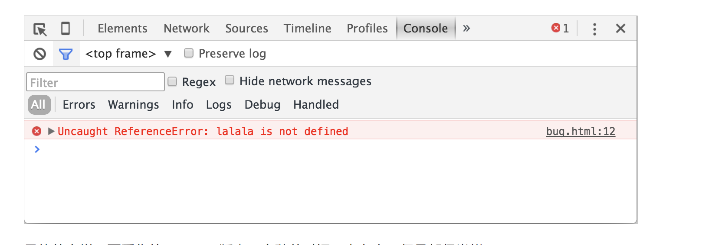
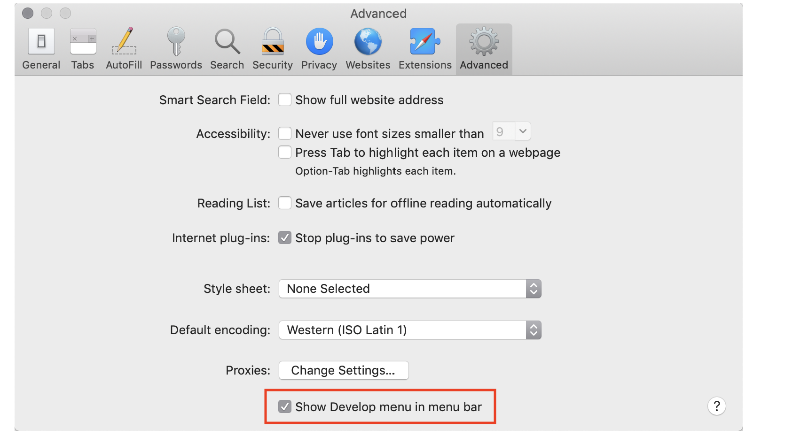

# 开发者控制台

在浏览器中，默认情况下用户是看不到错误的。所以，如果脚本中有错误，我们看不到是什么错误，更不能过修复它。
为了发现错误并且获得一些与脚本相关且有用的信息，浏览器内置了"开发者工具"。
通常，开发者工具倾向于使用 Chrome 或 Firefox 进行开发，因为它们有最好的开发者工具。一些其他的浏览器也提供开发者工具，有时还具有一些特殊功能，通常它们都是在"追赶"Chrome 或 Firefox。所以大多数人都有“最喜欢”的浏览器。
开发者工具很强大，功能丰富。首先，我们将学习如歌打开它们，查找错误和运行 JavaScript 命令。

## Google Chrome

打开网页[bug.html](https://zh.javascript.info/article/devtools/bug.html)。
在这个网页的 JavaScript 代码中有一个错误。一般的访问者不能看到这个错误，所以让我们打开开发者工具看看
按下`f12`键，如果你使用 Mac，试试`Cmd+Opt+j`。
默认情况下，开发者工具会被在 Console 标签页中打开。
例如这样:

具体啥样，就需要看你的 Chrome 版本。它随着时间一直在变，但是都很类似。

- 在我们能看到红色的错误提示信息。这个场景中，脚本里有一个未知的"lalala"命令。
- 在右边，有个可点击链接`bug.html:12`。在这个链接会链接到错误发生的行号。

在错误信息的下方，有个`>`标志，它代表“命令行”中，我们可以输入 JavaScript 命令，按下`Enter`来执行。
现在，我们能看到错误就够了。在[浏览器中调试](https://zh.javascript.info/debugging-chrome)一节中，我们会重新更加深入地学习开发者工具。

> 通常，当我们向控制台输入一行代码后，按`Enter`,这行代码就会立即执行。
> 如果想要插入多行代码，请按`Shirt+Enter`来进行换行。这样就可以输入唱片端的 JavaScript 代码了。

## Firefox，Edge 和其他浏览器

大多数其他的浏览器都是通过`f12`来打开开发者工具。

## Safari

Safari(Mac 系统中的浏览器，Windows 和 Linux 系统不支持)有点点不同，我们需要先开启“开发菜单”。
打开“偏好设置”，选择“高级”选项。选中最下方的那个选择框：

现在，我们通过`Cmd+Opt+C`就能打开或关闭控制台了。另外注意，有一个名字为“开发”的顶部菜单出现了。它有很多命令和选项。

## 总结

- 开发者工具允许我们查看错误，执行命令，检查变量等。
- 在 Windows 系统中，可以通过`f12`开启开发者工具。Mac 系统下，Chrome 需要使用`Cmd+Opt+J`,Safari 使用`Cmd+Opt+C`(需要提前开启)
