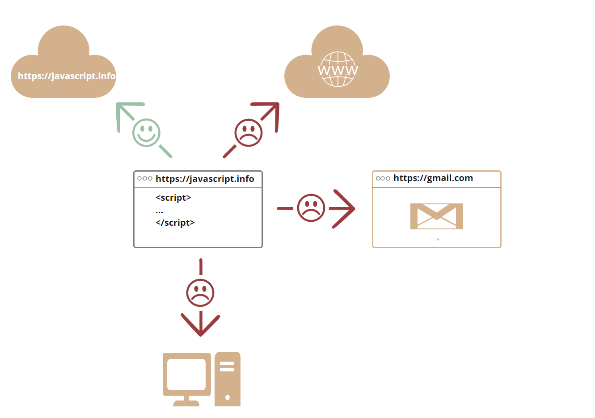

# JavaScript 简介

让我们来看看 JavaScript 有什么特别之处，我们可以用它实现什么，以及哪些其他技术可以与其搭配产生奇妙的效果。

## 什么是 JavaScript？

avaScript 最初被创建的目的是“使网页更生动”。

这种编程语言写出来的程序被称为 **脚本** 。它们可以被直接写在网页的 HTML 中，在页面加载的时候自动执行。

脚本被以纯文本的形式提供和执行。它们不需要特殊的准备或编译即可运行。

# 这方面，JavaScript 和 [Java](<https://en.wikipedia.org/wiki/Java*(programming*language)>)有很大的区别。

这方面，JavaScript 和 [Java](https://en.wikipedia.org/wiki/Java*(programming_language)有很大的区别。

> 为什么叫 JavaScript？
> JavaScript 在刚诞生的时候，它的名字叫 “LiveScript”。但是因为当时 Java 很流行，所以决定将一种新语言定位为 Java 的“弟弟”会有助于它的流行。
> 随着 JavaScript 的发展，它已经成为了一门完全独立的语言，并且也拥有了自己的语言规范 [ECMAScript](http://en.wikipedia.org/wiki/ECMAScript)。现在，它和 Java 之间没有任何关系。

- V8 —— Chrome、Opera 和 Edge 中的 JavaScript 引擎。

> 1. 引擎（如果是浏览器，则引擎被嵌入在其中）读取（“解析”）脚本。
> 2. 然后，引擎将脚本转化（“编译”）为机器语言。
> 3. 然后，机器代码快速地执行。



```js
<!DOCTYPE HTML>
<html>

<body>

  <p>script 标签之前...</p>

  <script>
    alert('Hello, world!');
  </script>

  <p>...script 标签之后</p>

</body>

</html>
```

`type `特性：`<script type=…>`
