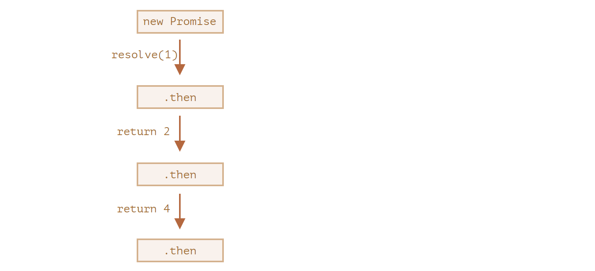

# Promise 链

我们回顾一下 [简介:回调](https://zh.javascript.info/callbacks)一章中提到的问题:我们有一系列的异步任务一个接一个地执行--例如，加载脚本。我们如何写出更好的代码呢？

Promise 提供了一些方案来做到这一点。

在本章中，我们将学习 promise 链。

它看起来就像这样:

```js
new Promise(function (resolve, reject) {
  setTimeout(() => resolve(1), 1000); //(*)
})
  .then(function (result) {
    // (**)

    alert(result); // 1
    return result * 2;
  })
  .then(function (result) {
    // (***)

    alert(result); // 2
    return result * 2;
  })
  .then(function (result) {
    alert(result); // 4
    return result * 2;
  });
```

它的想法是通过`.then`处理程序(handler)链进行传递 result。

运行流程如下:

1. 初始 promise 在 1 秒后 resolve`(*)`，
2. 然后`.then`处理程序被调用`(**)`，它又创建了一个新的 promise(以`2`作为值 resolve)。
3. 下一个` then``(***) `得到了前一个`then`的值，对该值进行处理(\*2)并将其传递给下一个处理程序。
4. ....依此类推。

随着 result 在处理程序链中传递，我们可以看到一系列的`alert`调用:`1` → `2` → `4`



这样之所以是可行的，是因为每个对`.then`的调用都会返回了一个新的 promise，因此我们可以在其之上调用下一个`.then`。

当处理程序返回一个值时，它将成为该 promise 的 result，所以将使用它调用下一个`.then`。

**新手常犯的一个经典错误:从技术上讲，我们也可以将多个`.then`添加到一个 promise 上。但这并不是 promise 链(chaining)。**

例如:

```js
let promise = new Promise(function (resolve, reject) {
  setTimeout(() => resolve(1), 1000);
});

promise.then(function (result) {
  alert(result); //1
  return result * 2;
});

promise.then(function (result) {
  alert(result); //1
  return result * 2;
});

promise.then(function (result) {
  alert(result); //1
  return result * 2;
});
```

我们在这里所做的只是一个 promise 的几个处理程序。它们不会相互传递 result;相反，它们之间彼此独立运行处理任务。

这是它的一张示意图(你可以将其与上面的链式调用做一下对比):


在同一个 promise 上的所有`.then`获得的结果都相同--该 promise 的结果。所以，在上面的代码中，所有`alert`都显示相同的内容:`1`。

实际上我们极少遇到一个 promise 需要多个处理程序的情况。使用链式调用的频率更高。

## 返回 promise

`.then(handler)`中所使用的处理程序(handler)可以创建并返回一个 promise。

在这种情况下，其它的处理程序等待它 settled 后再获得其结果。

例如:

```js
new Promise(function (resolve, reject) {
  setTimeout(() => resolve(1), 1000);
})
  .then(function (result) {
    alert(result); //1

    return new Promise((resolve, reject) => {
      // (*)
      setTimeout(() => resolve(result * 2), 1000);
    });
  })
  .then(function (result) {
    //(**)

    alert(result); //2

    return new Promise((resolve, reject) => {
      setTimeout(() => resolve(result * 2), 1000);
    });
  })
  .then(function (result) {
    alert(result); //4
  });
```

这里第一个`.then`显示`1`并在`(*)`行返回`new Promise(...)`。1 秒后它会进行 resolve，然后 result(`resolve`的参数，在这里它是`result * 2`)被传递给第二个`.then`的处理程序。这个处理程序位于(`**`)行，它显示`2`，并执行相同的行为。

所以输出与前面的示例相同:`1` → `2` → `4`,但是现在在每次`alert`调用之间会有 1 秒钟的延迟。、

返回 promise 使我们能够构建异步行为链。

## 示例 : loadScript
