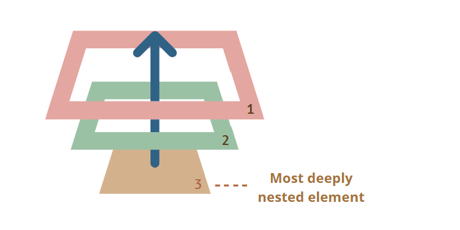
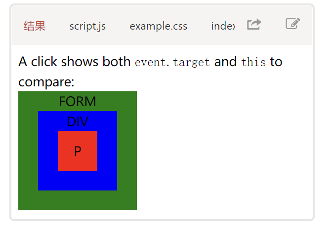

# 冒泡和捕获

处理程序(handler)被分配给了`<div>`，但是如果你点击任何嵌套的标签(例如`<em>`或`<code>`)，该处理程序也会运行:

```html
<div onclick="alert(`The handler!`)">
  <em>If you click on<code>EM</code>,the handler on <code>DIV</code> runs.</em>
</div>
```

这是不是有点奇怪？如果实际上点击的是`<em>`，为什么在`<div>`上的处理程序会运行？

## 冒泡

冒泡(bubbling)原理很简单。

**当一个事件发生在一个元素上，它会首先运行在该元素上的处理程序，然后运行其父元素上的处理程序，然后一直向上到其他祖先上的处理程序。**

假设我们有 3 层嵌套`FROM > DIV > p`,它们各自拥有一个处理程序:

```html
<style>
  body * {
    margin: 10px;
    border: 1px solid blue;
  }
</style>

<form onclick="alert('form')">
  FORM
  <div onclick="alert('div')">
    DIV
    <p onclick="alert('p')">P</p>
  </div>
</form>
```

点击内部的`<p>`会首先运行`onclick`:

1. 在该`<p>`上的。
2. 然后是外部`<div>`上的。
3. 然后是外部`<form>`上的。
4. 以此类推，直到最后的`document`对象。



因此，如果我们点击`<p>`，那么我们将看到 3 个 alert:`p`->`div`->`form`。

这个过程被称为"冒泡(bubbling)"，因为事件从内部元素"冒泡"到所有父级，就像在水里的气泡一样。

> **几乎所有事件都会冒泡**
> 这句话中的关键词是"几乎".
>
> 例如，`focus`事件不会冒泡。同样，我们以后还会遇到其他例子。但这仍然是例外，而不是规则，大多数事件的确都是冒泡的。

## event.target

父元素上的处理程序始终可以获取事件实际发生位置的详细信息。

**引发事件的那个嵌套层级最深的元素被称为目标元素，可以通过`event.target`访问。**

注意与`this`(=`event.currentTarget`)之间的区别:

- `event.target`--是引发事件的"目标"元素，它在冒泡过程中不会发生变化。
- `this`--是"当前"元素，其中有一个当前正在运行的处理程序。

例如，如果我们有一个处理程序`form.onclick`，那么它可以"捕获"表单内的所有点击。无论点击发生在哪里，它都会冒泡到`<form>`并运行处理程序。

在`form.onclick`处理程序中:

- `this`(=`event.currentTarget`)是`<form>`元素，因为处理程序在它上面运行。
- `event.target`是表单中实际被点击的元素。



`event.target`可能会等于`this`--当点击事件发生在`<form>`元素上时，就会发生这种情况。

## 停止冒泡

冒泡事件从目标元素开始向上冒泡。通常，它会一直上升到`<html>`，然后再到`document`对象，有些事件甚至会到达`window`，它们会调用路径上所有的处理程序。

但是任意处理程序都可以决定事件已经被完全处理，并停止冒泡。

用于停止冒泡的方法是`event.stopPropagation()`。

例如，如果你点击`<button>`，这里的`body.onclick`不会工作:

```html
<body onclick="alert(`the bubbling doesn't reach here`)">
  <button onclick="event.stopPropagation()">Click me</button>
</body>
```

> **不要在没有需要的情况下停止冒泡！**
> 冒泡很方便。不要在没有真实需求时阻止它:除非是显而易见的，并且在架构上经过深思熟虑的。
>
> 有时`event.stopPropagation()`会产生隐藏的陷阱，以后可能会成为问题。
>
> 例如：
>
> 1. 我们创建了一个嵌套菜单，每个子菜单各自处理对自己的元素的点击事件，并调用`stopPropagation`,以便不会触发外部菜单。
> 2. 之后，我们决定捕获在整个窗口上的点击，以追踪用户的行为(用户点击的位置)。有些分析系统会这样做。通常，代码会使用`document.addEventListener('click'...)`来捕获所有的点击。
> 3. 我们的分析不适用于被`stopPropagation`所阻止点击的区域。太伤心了，我们有一个"死区".
>
> 通常，没有真正的必要去阻止冒泡。一项看似需要阻止冒泡的任务，可以通过其他方法解决。其中之一就是使用自定义事件，稍后我们会介绍它们此外，我们还可以将我们的数据写入一个处理程序中读取该数据，这样我们就可以向父处理程序传递有关下层处理程序的信息。

## 捕获

事件处理的另一个阶段被称为"捕获(capturing)"。它很少被用在实际开发中，但有时是有用的。
