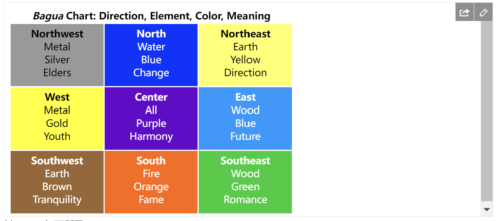
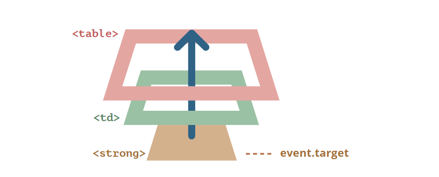

# 事件委托

捕获和冒泡允许我们实现最强大的事件处理模式之一，即**事件委托**模式。

这个想法是，如果我们有许多以类似方式处理的元素，那么就不必为每个元素分配一个处理程序--而是将当个处理程序放在它们的共同祖先上。

在处理程序中，我们获取`event.target`以查看事件实际发生的位置并进行处理。

让我们看一个示例--反映中国古代哲学的八卦图。

如下所示:


其 HTML 如下所示:

```html
<table>
  <tr>
    <th colspan="3"><em>Bagua</em>Chart:Direction,Element,Color,Meaning</th>
  </tr>
  <tr>
    <td class="nw"><strong>Northwest</strong><br />Sliver<br />Elders</td>
    <td class="n">...</td>
    <td class="ne">...</td>
  </tr>
  <tr>
    ...2 more lines of this kind...
  </tr>
  <tr>
    ...2 more lines of this kind...
  </tr>
</table>
```

该表格有 9 个单元格(cell),但可以有 99 或 9999 个单元格，这都不重要。

**我们的任务是在点击时高亮显示被点击的单元格**`<td>`。

与其为每个`<td>`(可能有很多)分配一个`onclick`处理程序--我们可以在`<table>`元素上设置一个"捕获所有"的处理程序。

它将使用`event.target`来获取点击的元素并高亮显示它。

代码如下:

```js
let selectedTd;

table.onclick = function (event) {
  let target = event.target; //在哪里点击的?

  if (target.tagName != "TD") return; // 不在 TD 上？那么我们就不会在意

  highlight(target); // 高亮显示它
};

function highlight(td) {
  if (selectedTd) {
    //移除现有的高亮显示，如果有的话
    selectedTd.classList.remove("highlight");
  }
  selectedTd = td;
  selectedTd.classList.add("highlight"); //高亮显示新的 td
}
```

此代码不会关心在表格中有多少个单元格。我们可以随时动态添加/移除`<td>`，高亮显示仍然有效。

尽管如此，但还是存在缺陷。

点击可能不是发生在`<td>`上，而是发生在其内部。

在我们的例子中，如果我们看一下 HTML 内部，我们可以看到`<td>`内还有嵌套的标签，例如`<strong>`:

```html
<td>
  <strong>Northwest</strong>
  ....
</td>
```

自然地，如果在该`<strong>`上点击，那么它将成为`event.target`的值。



在处理程序`table.onclick`中，我们应该接受这样的`event.target`，并确定该点击是否在`<td>`内。

下面是改进后的代码:

```js
table.onclick = function (event) {
  let id = event.target.closest("td"); // (1)

  if (!td) return; // (2)

  if (!table.contains(td)) return; //(3)

  highlight(td); //(4)
};
```

解释:

1. `elem.closest(selector)`方法返回与`selector`匹配的最近的祖先。在我们的例子中，我们从源元素开始向上寻找`<td>`。
2. 如果`event.target`不在任何`<td>`中，那么调用将立即返回，因为这里没有什么事可做。
3. 对于嵌套的表格，`event.target`可能是一个`<td>`，但位于当前表格之外。因此我们需要检查它是否是**我们的表格中的**`<td>`。
4. 如果是的话，就高亮显示它。

最终，我们得到了一个快速，高效的用于高亮显示的代码，该代码与表格中的`<td>`的数量无关。

## 委托示例：标记中的行为

事件委托还有其他用途。(译注：本节标题中的"标记中的行为"即 action in markup)

例如，我们想要编写一个有"保存"、"加载"和"搜索"等按钮的菜单。并且，这里有一个具有`save`、`load`和`search`等方法的对象。如何匹配它们？

第一个想法可能是为每个按钮分配一个单独的处理程序。但是有一个更优雅的解决方案。我们可以为整个菜单添加一个处理程序，并为具有方法调用的按钮添加`data-action`特性(attribute):

```html
<button data-action="save">Click to Save</button>
```

处理程序读取特性(attribute)并执行该方法。工作示例如下:

```html
<div id="menu">
  <button data-action="save">Save</button>
  <button data-action="load">Load</button>
  <button data-action="search">Search</button>
</div>

<script>
  class Menu {
    constructor(elem) {
      this._elem = elem;
      elem.onclick = this.onClick.bind(this); //(*)
    }

    save() {
      alert("saving");
    }

    load() {
      alert("loading");
    }

    search() {
      alert("searching");
    }

    onClick(event) {
      let action = event.target.data.action;
      if (action) {
        this[action]();
      }
    }
  }

  new Menu(menu);
</script>
```

请注意，`this.onClick`在`(*)`行中被绑定到了`this`。
这很重要，因为否则内部的`this`将引用 DOM 元素(`elem`)，而不是`Menu`对象，那样的话，
`this[action]`将不是我们所需要的。

那么，这里的委托给我们带来了什么好处？

> - 我们不需要编写代码来为每个按钮分配一个处理程序。只需要创建一个方法并将其放入标记(markup)中即可。
> - HTML 解构非常灵活，我们可以随时添加/移除按钮。

我们也可以使用`.action-save`，`.action-load`类，但`data-action`特性(attribute)在语义上更好。我们也可以在 CSS 规则中使用它。

## "行为"模式

我们还可以使用事件委托将“行为（behavior）”以**声明方式**添加到具有特殊特性（attribute）和类的元素中
