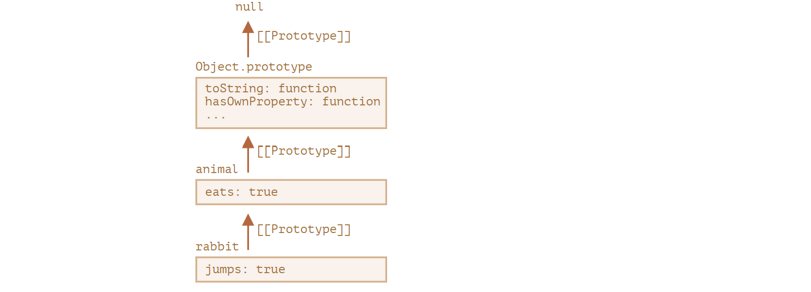

# 原型继承

在编程中，我们经常会想获取并扩展一些东西。

例如，我们有一个`user`对象及其属性和方法，并希望将`admin`和`guest`作为基于`user`稍加修改的变体。我们想重用`user`中的内容，而不是复制/重新实现它的方法，而是在其之上构建一个新的对象。

**原型继承(Prototypal inheritance)**这个语言特性能够帮助我们实现这一需求。

## [[Prototype]]

在 JavaScript 中，对象有一个特殊的隐藏属性
`[[Prototype]]`(如规范中所命名的)，它要么为`null`,要么就是对另一个对象的应用。该对象被称为“原型”:


当我们从`object`中获取一个缺失的属性时，JavaScript 会自动从原型中获取该属性。在编程中，这被称为“原型继承”。很快，我们将通过很多示例来学习此类继承，以及基于此类继承的更炫酷的语言功能。

属性`[[Prototype]]`是内部的而且是隐藏的，但是这有很多设置它的方式。

其中之一就是使用特殊的名字`_proto_`，就像这样:

```js
let animal = {
  eats: true,
};
let rabbit = {
  jumps: true,
};

rabbit._proto_ = animal; //设置 rabbit.[[Prototype]] = animal
```

现在，如果我们从`rabbit`中读取一个它没有的属性，
JavaScript 会自动从`animal`中获取。

例如:

```js
let animal = {
  eats: true,
};
let rabbit = {
  jumps: true,
};

rabbit._proto_ = animal; // (*)

//现在这两个属性我们都能在 rabbit 中找到:
alert(rabbit.eats); // true (**)
alert(rabbit.jumps); // true
```

这里的`(*)`行将`animal`设置为`rabbit`的原型。

当`alert`试图读取`rabbit.eats` `(**)`时，因为它不存在于`rabbit`中，所以 JavaScript 会顺着`[[Prototype]]`引用，在`animal`中查找(自上而下):


在这我们可以说"`animal`是`rabbit`的原型"，或者说"`rabbit`的原型是从`animal`继承而来的"。

因此，如果`animal`有许多有用的属性和方法，那么它们将自动地变为在`rabbit`中可用。这种属性被称为“继承”。

如果我们在`animal`中有一个方法，它可以在`rabbit`中被调用:

```js
let animal = {
  eats: true,
  walk() {
    alert("Animal walk");
  },
};

let rabbit = {
  jumps: true,
  _proto_: animal,
};

// walk 方法是从原型中获得的
rabbit.walk(); //Animal walk
```

该方法是自动地从原型中获得的，像这样:


原型链可以很长:

```js
let animal = {
  eats: true,
  walk() {
    alert("Animal walk");
  },
};

let rabbit = {
  jumps: true,
  _proto_: animal,
};

//walk 是通过原型链获得的
longEar.walk(); // Animal walk
alert(longEar.jumps); // true (从 rabbit)
```


现在，如果我们从`longEar`中读取一些它不存在的内容，JavaScript 会先在`rabbit`中查找，然后在`animal`中查找。

这里只有两个限制:  
1.引用不能形成闭环。如果我们试图在一个闭环中分配`_proto_`,JavaScript 会抛出错误。  
2.`_proto_`的值可以是对象，也可以是`null`。而其它的类型都会被忽略。

当然，这可能很显而易见，但是仍然要强调:只能有一个`[[Prototype]]`。一个对象不能从其它两个对象获得继承。

> **`_proto_`是`[[Prototype]]`的因历史原因而留下来的 getter/setter**
> 初学者常犯一个普遍的错误，就是不知道`_proto_`和`[[Prototype]]`的区别。
>
> 请注意，`_proto_`与`[[Prototype]]`的内部**不一样**。`_proto_`是`[[Prototype]]`的 getter/setter。稍后，我们将看到在什么情况下理解它们很重要，在建立对 JavaScript 语言的理解时，让我们牢记这一点。
>
> `_proto_`属性有点过时了。它的存在是出于历史的原因，现代编程语言建议我们应该使用函数`Object.getPrototypeOf/Object.setPrototypeOf`来取代`_proto_`去 get/set 原型。稍后我们将介绍这些函数。
>
> 根据规范，`_proto_`必须仅受浏览器环境的支持。但实际上，包括服务端在内的所有环境都支持它，因此我们使用它是非常安全的。
>
> 由于`_proto_`标记在观感上更加明显，所以我们在后面的示例中将使用它。

## 写入不适用原型

原型仅用于读取属性。

对于写入/删除操作可以直接在对象上进行。

在下面的示例中，我们将为`rabbit`分配自己的`walk`:

```js
let animal = {
  eats: true,
  walk() {
    /*rabbit 不会使用此方法*/
  },
};

let rabbit = {
  _proto_: animal,
};

rabbit.walk = function () {
  alert("Rabbit! Bounce-bounce!");
};

rabbit.walk(); //Rabbit！ Bounce-bounce！
```

从现在开始，`rabbit.walk()`将立即在对象中找到该方法并执行，而无需使用原型:


访问器(accessor)属性是一个例外，因为分配(assignment)操作时由 setter 函数处理的。因此，写入此类属性实际上与调用函数相同。

也就是这个原因，所以下面这段代码中的`admin.fullName`能够正常运行:

```js
let user = {
  name: "John",
  surname: "Smith",

  set fullName(value) {
    [this.name, this.surname] = value.split(" ");
  },

  get fullName() {
    return `${this.name} ${this.surname}`;
  },
};

let admin = {
  _proto_: user,
  isAdmin: true,
};

alert(admin.fullName); // John Smith   (*)

// setter triggers!
admin.fullName = "Alice Cooper"; //(**)

alert(admin.fullName); // Alice Cooper,admin 的内容被修改了
alert(user.fullName); // John Smith,user 的内容被保护了
```

在`(*)`行中，属性`admin.fullName`在原型`user`中有一个 getter，因此它会被调用。在`(**)`行中，属性在原型中有一个 setter，因此它会被调用。

## "this"的值

在上面的例子中可能会出现一个有趣的问题:在`setfullName(value)`中`this`的值是什么？属性`this.name`和`this.surname`被写在哪里:在`user`还是`admin`?

答案很简单:`this`根本不受原型的影响。

**无论在哪里找到方法:在一个对象还是在原型中。在一个方法调用中，`this`始终是符号`.`前面的对象。**

因此，setter 调用`admin.fullName=`使用`admin`作为`this`，而不是`user`。

这是一件非常重要的事情，因为我们可能有一个带有很多方法的大对象，并且还有从其继承的对象。当继承的对象运行继承的方法时，它们将仅修改自己的状态，而不会修改大对象的状态。

例如，这里的`animal`代表“方法存储”，`rabbit`在使用其中的方法。

调用`rabbit.sleep()`会在`rabbit`对象上设置`this.isSleeping`:

```js
// animal 有一些方法
let animal = {
  walk() {
    if (!this.isSleeping) {
      alert("I walk");
    }
  },
  sleep() {
    this.isSleep = true;
  },
};

let rabbit = {
  name: "White Rabbit",
  _proto_: animal,
};

// 修改 rabbit.isSleeping
rabbit.sleep();

alert(rabbit.isSleeping); //true
alert(animal.isSleeping); //undefined
```

结构示意图:


如果我们还有从`animal`继承的其它对象，像`bird`和`snake`等，它们也将可以访问`animal`的方法。但是，每个方法调用中的`this`都是在调用时(点符号前)评估的对应的对象，而不是`animal`。因此，当我们将数据写入`this`时，会将其存储到这些对象中。

所以，方法是共享的，但对象状态不是。

## for...in 循环

`for...in`循环也会迭代继承的属性。

例如:

```js
let animal = {
  eats: true,
};

let rabbit = {
  jumps: true,
  _proto_: animal,
};

// Object.keys 只返回自己的 key
alert(Object.keys(rabbit)); //jumps

// for...in 会遍历自己以及继承的键
for (let prop in rabbit) alert(prop); // jumpd,然后是 eats
```

如果这不是我们想要的，并且我们想排除继承的属性，那么这儿有一个内建的方法[obj.hasOwnProperty(key)](https://developer.mozilla.org/en-US/docs/Web/JavaScript/Reference/Global_Objects/Object/hasOwnProperty):如果`obj`具有自己的(非继承的)名为`key`的属性，则返回`true`。

因此，我们可以过滤掉继承的属性(或对它们进行其它操作):

```js
let animal = {
  eats: true,
};

let rabbit = {
  jumps: true,
  _proto_: animal,
};

for (let prop in rabbit) {
  let isOwn = rabbit.hasOwnProperty(prop);

  if (isOwn) {
    alert(`Our:${prop}`); // Our: jumps
  } else {
    alert(`Inherited: ${prop}`); // Inherited:eats
  }
}
```

这里我们有以下继承链:`rabbit`从`animal`中继承，`animal`从`Object.prototype`中继承(因为`animal是对象字面量` `{...}`，所以这是默认的继承)，然后再向上是`null`:



注意，这有一件很有趣的事。方法`rabbit.hasOwnProperty`来自哪里？我们并没有定义它。从上图中的原型链我们可以看到，该方法是`Object.prototype.hasOwnProperty`提供的。换句话说，它是继承的。

....如果`for...in`循环会列出继承的属性，那为什么`hasOwnProperty`没有像`eats`和`jumps`那样出现在`for...in`循环中？

答案很简单:它是不可枚举的。就像`Object.prototype`的其它属性，`hasOwnProperty`有`enumerable:false`标志。并且`for..in`只会列出可枚举的属性。这就是为什么它和其余的`Object.prototype`属性都未被列出。

> **几乎所有其他键/值获取方法都忽略继承的属性**
> 几乎所有其它键/值获取方法，例如`Object.keys`和`Object.values`等，都会忽略继承的属性。
>
> 它们只会对对象自身进行操作。**不考虑**继承自原型的属性。

## 总结

- 在 JavaScript 中，所有的对象都有一个隐藏的`[[Prototype]]`属性，它要么是另一个对象的，要么就是`null`。
- 我们可以使用`obj._proto_`访问它(历史遗留下来的 getter/setter，这儿还有其他方法，很快我们就会讲到)。
- 通过`[[Prototype]]`引用的对象被称为"原型"。
- 如果我们想要读取`obj`的一个属性或者调用一个方法，并且它不存在，那么 JavaScript 就会尝试在原型中查找它。
- 写/删除操作直接在对象上进行，它们不适用原型(假设它是数据属性，不是 setter)。
- 如果我们调用`obj.method()`，而且`method`是从原型中获取的，`this`仍然会引用`obj`。因此，方法始终与当前对象一起使用，即使方法是继承的。
- `for...in`循环在其自身和继承的属性上进行迭代。所有其它的键/值获取方法仅对对象本身起作用。
