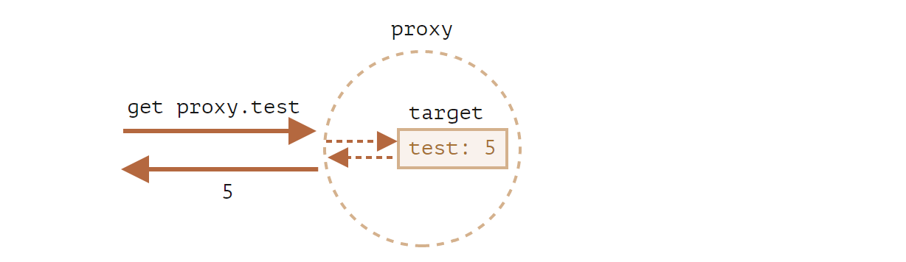

# Proxy 和 Reflect

一个`Proxy`对象包装另一个对象并拦截诸如读取/写入属性和其他操作，可以选择自行处理它们，或者透明地允许该对象处理它们。

Proxy 被用于了许多库和某些浏览器框架。在本文中，我们将看到许多实际应用。

## Proxy

语法:

```js
let proxy = new Proxy(target, handler);
```

- `target`--是要包装的对象，可以是任何东西，包括函数。
- `handler`--代理配置:带有"捕捉器"("traps",即拦截操作的方法)的对象。比如`get`捕捉器用于读取`target`的属性，`set`捕捉器用于写入`target`的属性，等等。

对`proxy`进行操作，如果在`handler`中存在相应的捕捉器，则它将运行，并且 Proxy 有机会对其进行处理，否则将直接对 target 进行处理。

首先，让我们创建一个没有任何捕捉器的代理(Proxy):

```js
let target = {};
let proxy = new Proxy(target, {}); //空的 handler 对象

proxy.test = 5; //写入 proxy 对象 (1)
alert(target.test); //5，test 属性出现在了 target 中！

alert(proxy.test); //5,我们也可以从 proxy 对象读取它 (2)

for (let key in proxy) alert(key); //test,迭代也正常工作 (3)
```

由于没有捕捉器，所以对`proxy`的操作直接转发给了`target`。

1. 写入操作`proxy.test=`会将值写入`target`。
2. 读取操作`proxy.test`会从`terget`返回对应的值。
3. 迭代`proxy`会从`target`返回对应的值。

我们可以看到，没有任何捕捉器，`proxy`是一个`target`的透明包装器(wrapper)。



`Proxy`是一种特殊的"奇异对象(exotic object)"。它没有自己的属性。如果`handler`为空，则透明地将操作转发给`target`。

要激活更多功能，让我们添加捕捉器。

我们可以用它们拦截什么？

对于对象的大多数操作，JavaScript 规范中有一个所谓的"内部方法"，它描述了最底层的工作方式。例如`[[Get]]`，用于读取属性的内部方法，`[[Set]]`，用于写入属性的内部方法，等等。这些方法仅在规范中使用，我们不能直接通过方法名调用它们。

Proxy 捕捉器会拦截这些方法的调用。它们在[proxy 规范](https://tc39.es/ecma262/#sec-proxy-object-internal-methods-and-internal-slots)和下表中被列出。

对于每个内部方法，此表中有一个捕捉器:可用于添加到`new Proxy`的`handler`参数中以拦截操作的方法名称:
|**内部方法**|**Handler 方法**|**何时触发**|
|:----:|:----:|:----:|
|[[Get]]|get|读取属性|
|[[Set]]|set|写入属性|
|[[HasProperty]]|has|`in`操作符|
|[[Delete]]|deleteProperty|`delete`操作符|
|[[Call]]|apply|函数调用|
|[[Construct]]|construct|`new`操作符|
|[[GetPrototypeOf]]|getPrototypeOf|[Object.getPrototypeOf](https://developer.mozilla.org/zh/docs/Web/JavaScript/Reference/Global_Objects/Object/getPrototypeOf)|
|[[SetPrototypeOf]]|setPrototypeOf|[Object.setPrototypeOf](https://developer.mozilla.org/zh/docs/Web/JavaScript/Reference/Global_Objects/Object/setPrototypeOf)|
|[[IsExtensible]]|isExtensions|[Object.isExtensible](https://developer.mozilla.org/zh/docs/Web/JavaScript/Reference/Global_Objects/Object/isExtensible)|
|[[PreventExtensions]]|preventExtensions|[Object.preventExtensions](https://developer.mozilla.org/zh/docs/Web/JavaScript/Reference/Global_Objects/Object/preventExtensions)|
|[[DefineOwnProperty]]|defineProperty|[Object.defineProperty](https://developer.mozilla.org/zh/docs/Web/JavaScript/Reference/Global_Objects/Object/defineProperty), [Object.defineProperties](https://developer.mozilla.org/zh/docs/Web/JavaScript/Reference/Global_Objects/Object/defineProperties)|
|[[GetOwnProperty]]|getOwnPropertyDescriptor|[Object.getOwnPropertyDescriptor](https://developer.mozilla.org/zh/docs/Web/JavaScript/Reference/Global_Objects/Object/getOwnPropertyDescriptor), for...in,Object.keys/values/entries|
|[[OwnPropertyKeys]]|ownKeys|[Object.getOwnPropertyNames](https://developer.mozilla.org/zh/docs/Web/JavaScript/Reference/Global_Objects/Object/getOwnPropertyNames), [Object.getOwnPropertysymbols](https://developer.mozilla.org/zh/docs/Web/JavaScript/Reference/Global_Objects/Object/getOwnPropertySymbols), `for..in`, `Object.keys/values/entries`|
